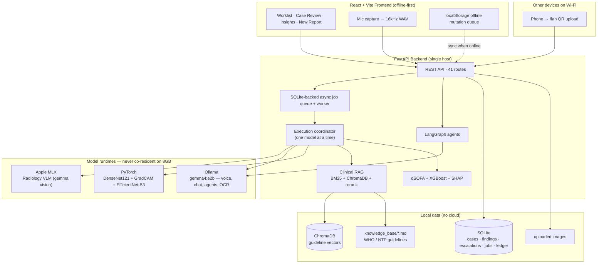
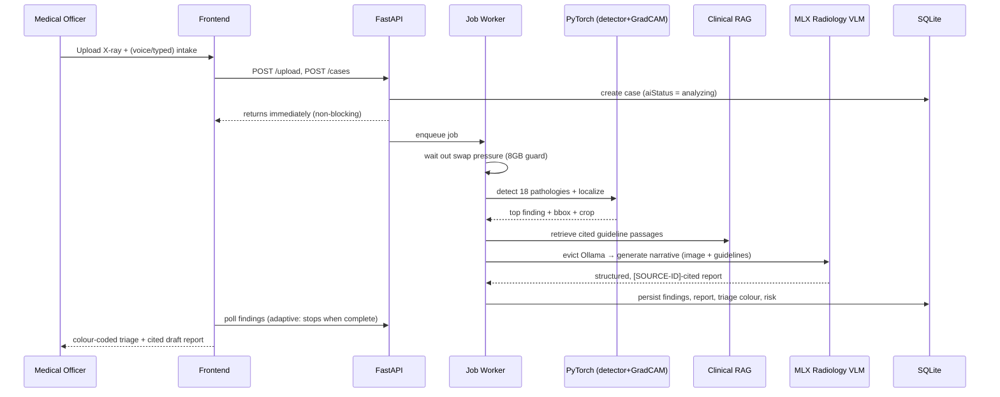
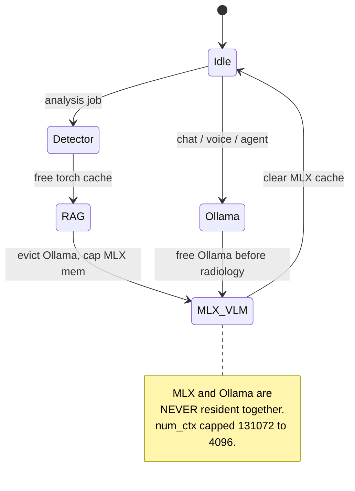
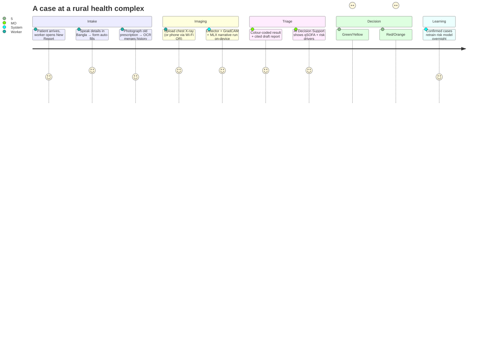

# RadFlow-Edge — Project Information & Pitch Dossier

> **One line:** An offline-first, on-device AI radiology triage assistant that lets a single rural medical officer read chest X-rays, score patient deterioration risk, capture intake by Bangla/English voice, and escalate only the uncertain cases — on a mid-range laptop, with no internet and no patient data ever leaving the device.

---

## 1. The Problem & Market

### The gap
In Bangladesh and comparable low-resource settings, the bottleneck in radiology is **not imaging hardware — it is interpretation**. District and upazila health complexes often have an X-ray machine but no on-site radiologist. Films queue for hours or days, so time-critical conditions (tuberculosis, pneumonia, heart failure) go undiagnosed at the point of care.

Three compounding constraints:
- **Specialist scarcity.** Radiologists are concentrated in a few cities; rural facilities share them remotely, if at all.
- **Connectivity & cost.** Cloud CAD tools assume reliable internet, per-study fees, and English-only interfaces — none of which hold at a rural PHC.
- **Data sovereignty.** Patient images and records are PHI; routing them to a cloud raises privacy, legal, and trust barriers.

### Why now
- On-device models small enough to run on a laptop (sub-5 B quantised LLMs/VLMs, 28 MB CNNs) have become genuinely capable.
- Apple Silicon / consumer GPUs put usable inference in reach of a ~US$1,000 machine.
- Bangladesh runs one of the world's largest community-health-worker programs (the *Shasthya Shebika* model), giving a ready last-mile distribution channel for a tool like this.

> **Market framing for the pitch:** Bangladesh is on the WHO list of high-TB-burden countries, chest radiography is central to TB and respiratory triage, and rural facilities are chronically under-served for image interpretation. *Verify the exact figures (radiologist-per-capita, TB incidence, CHW headcount) against current WHO / DGHS sources before quoting them on stage.*

### Why this project is strong
- **Solves a real, validated bottleneck** (interpretation latency) rather than adding another cloud CAD.
- **Edge-first by design** — works exactly where the need is highest (no internet, low budget, PHI-sensitive).
- **Human-in-the-loop and conservative** — every output is a labelled *draft* with a cited rationale; the clinician decides.
- **Multimodal & local-language** — voice + document intake in Bangla/English lowers the literacy and data-entry barrier for frontline workers.
- **Defensible engineering** — strict one-model-at-a-time memory governance makes it genuinely run on 8 GB, which most "edge AI" demos cannot.

---

## 2. What It Does (Capabilities at a glance)

| Capability | How |
|---|---|
| Chest X-ray pathology detection | TorchXRayVision DenseNet121 — **18 pathologies** |
| Anomaly localisation | GradCAM heatmap + bounding box |
| Radiology narrative report | Gemma vision VLM on **Apple MLX**, grounded in WHO/NTP guidelines with citations |
| Dermatology triage | EfficientNet-B3 — **7 skin-lesion classes** |
| Deterioration risk | qSOFA rule engine + XGBoost model with SHAP explanations |
| Voice intake | Bangla/English/code-mixed speech → structured form (Gemma audio) |
| Document intake | Prescription/lab-slip photo → fields (Tesseract OCR + extraction) |
| Clinical copilot | Case-grounded Q&A with guideline citations |
| Agentic workflows | Triage reasoning, morning briefing, escalation drafting, intake scribe |
| LAN intake portal | Phones on the same Wi-Fi upload images via a QR code |

**Total predictable conditions: 25** — 18 chest pathologies + 7 dermatology classes.

The 18 chest pathologies

Atelectasis, Consolidation, Infiltration, Pneumothorax, Edema, Emphysema, Fibrosis, Effusion, Pneumonia, Pleural Thickening, Cardiomegaly, Nodule, Mass, Hernia, Lung Lesion, Fracture, Lung Opacity, Enlarged Cardiomediastinum.

The 7 dermatology classes

Melanoma, Basal-cell carcinoma, Actinic keratosis, Benign nevus, Seborrheic keratosis, Dermatofibroma, Vascular lesion.

---

## 3. AI Features — Agentic vs Non-Agentic

### Agentic (reason → act with tools)
1. **Triage Reasoner** — a LangGraph state machine: `retrieve guidelines → score risk → reason → decide (route / monitor / escalate)`. Every transition is an explicit, auditable node.
2. **Intake Scribe** — voice and document → typed, Pydantic-validated patient fields; strictly extractive (unstated fields return null, never hallucinated).
3. **Morning Briefing** — summarises the overnight worklist and proposes a prioritised review order.
4. **Escalation Drafter** — composes a structured specialist-referral note from the case context.
5. **Clinical Copilot** — case-grounded Q&A; pulls guideline passages and answers with `[SOURCE-ID]` citations.

Exposed to external dev/eval agents via **two MCP servers** (`radflow-clinical-rag-mcp`, `radflow-intake-scribe-mcp`) over stdio.

### Non-agentic (deterministic / single-pass models)
- **Detector** — DenseNet121 multi-label pathology scoring.
- **Localizer** — GradCAM saliency → heatmap + bbox.
- **Foveal preprocessor** — OpenCV contrast crop reducing VLM token load ~80%.
- **qSOFA rule engine** — transparent Sepsis-3 bedside score (never a black box).
- **Risk model** — XGBoost deterioration probability + SHAP attributions.
- **Retrieval** — hybrid BM25 + dense (ChromaDB) with HyDE expansion, cross-encoder rerank, semantic chunking, cited passages.

---

## 4. How It Works

### 4.1 System architecture

### 4.2 Analysis flow (a single chest X-ray)

### 4.3 One-model-at-a-time memory governance (the edge trick)

---

## 5. Tech Stack

| Layer | Technology | Role |
|---|---|---|
| Frontend | React 18, TypeScript, Vite 6, Tailwind v4, Radix/shadcn, Recharts | Offline-first clinical UI + analytics |
| Backend | FastAPI, Uvicorn, Pydantic v2 | REST API, validation, async job queue |
| Data | SQLite + SQLAlchemy, ChromaDB | Relational records + guideline vectors |
| Detector | PyTorch, TorchXRayVision (DenseNet121) | 18-pathology chest CXR scoring |
| Localizer | pytorch-grad-cam | Saliency heatmaps + bounding boxes |
| Radiology VLM | **Apple MLX**, `mlx-vlm` (gemma-3-4b-it-4bit) | On-device radiology narrative |
| Gemma services | **Ollama**, `gemma4:e2b` | Voice, copilot, agents, OCR extraction |
| Dermatology | timm (EfficientNet-B3) | 7-class skin-lesion triage |
| Retrieval / RAG | sentence-transformers (MiniLM), rank-bm25, cross-encoder reranker, LlamaIndex | Hybrid search + HyDE + cited passages |
| Agents | LangGraph, Pydantic-AI | Multi-step reasoning + typed outputs |
| Risk ML | XGBoost, SHAP | Deterioration probability + explanations |
| Rule engine | Custom qSOFA (Sepsis-3) | Transparent bedside safety score |
| Voice / OCR | Gemma audio (Ollama /v1), Tesseract (ben+eng) | Bangla/English intake |
| Protocols | MCP (clinical-rag, intake-scribe) | Tooling for dev/eval agents |
| Orchestration | Prefect | Nightly sync, backup, RAG refresh, fine-tune |
| Continual learning | MLX QLoRA, XGBoost retrain | Nightly on-device improvement |
| Federation | Flower (FedAvg simulation) | Multi-clinic model sharing without raw data |
| Evaluation | RAGAS-style harness + regression fixtures | Offline RAG quality gates |
| LAN intake | qrcode + self-contained HTML portal | Phone uploads over Wi-Fi |

---

## 6. Design Principles

- **Calm, clinical UI.** Colour-coded triage (red / orange / yellow / green), generous spacing, no decorative motion; respects `prefers-reduced-motion`.
- **Drafts, not verdicts.** Every AI output is labelled "Draft Preliminary Findings" with a cited rationale and a confidence percentage.
- **Decision support where the work happens.** The Case Review screen carries an *AI Decision Support* card (deterioration risk + one-click triage reasoning and referral drafting).
- **Offline as a feature, not a fallback.** Mutations queue locally and reconcile when connectivity returns; fonts and assets are bundled, not CDN-loaded.
- **Lean by intention.** The frontend was pruned of ~30 unused Figma-export dependencies; heavy screens are route-level code-split.

---

## 7. Full-Scale Usage Pipeline (Medical Officer's day)

**Step by step:**
1. **Register & intake** — voice or typed; optional document photo auto-fills history.
2. **Capture image** — directly, or a colleague's phone uploads it over the LAN portal.
3. **Automated analysis** — detector → localizer → guideline-cited MLX narrative, all queued and non-blocking.
4. **Triage** — the worklist surfaces cases by colour and waiting time; Case Review shows the draft, heatmap, vitals, and deterioration risk.
5. **Act** — manage locally with guideline-backed guidance, or one-click draft a specialist referral and escalate.
6. **Escalation review** — a remote specialist (when reachable) reviews escalated cases through the same record.
7. **Overnight** — Prefect runs backup, RAG refresh, and continual-learning retrain from the day's clinician-confirmed cases.

---

## 8. Requirements

### Functional
- FR1 — Detect ≥18 chest pathologies from an uploaded radiograph and localise the top finding.
- FR2 — Generate a structured, guideline-cited draft report on-device.
- FR3 — Capture patient intake by Bangla/English/code-mixed voice and by document OCR, strictly extractively.
- FR4 — Compute deterioration risk (qSOFA + model) with an explanation.
- FR5 — Provide a case-grounded clinical copilot with citations.
- FR6 — Triage cases by colour and waiting time; support escalation with an AI-drafted referral.
- FR7 — Accept image uploads from other devices on the LAN.
- FR8 — Persist patient records, findings, escalations, and an immutable inference ledger locally.
- FR9 — Run dermatology triage on a skin-lesion photo.
- FR10 — Retain and reconcile mutations made while offline.

### Non-functional
- NFR1 — **Offline-first**: full core workflow with no internet; no PHI egress.
- NFR2 — **Runs on 8 GB** unified-memory hardware; one model resident at a time; swap-aware backpressure.
- NFR3 — **Latency**: case creation is non-blocking; analysis completes asynchronously (tens of seconds on the reference box).
- NFR4 — **Safety**: all outputs labelled drafts; human-in-the-loop before any clinical action; conservative rule-engine floor.
- NFR5 — **Reliability**: graceful degradation (MLX → Ollama fallback; detector-only if the LLM is down); bounded retries.
- NFR6 — **Auditability**: per-inference ledger with model/version/latency; immutable event log.
- NFR7 — **Maintainability**: modular services, route-level code-splitting, lean dependency surface.
- NFR8 — **Portability**: Apple Silicon, NVIDIA, and CPU-only paths.

---

## 9. Business Model

- **Who pays:** governments / NGOs / hospital networks deploying to rural facilities; donor-funded TB and MCH programs.
- **Pricing:** per-device or per-facility annual license (no per-study cloud fees), with a free tier for single-clinic pilots. Optional paid support, model-update subscriptions, and a managed specialist-relay tier.
- **Why it sells:** one-time hardware (~US$1,000 laptop), zero cloud cost, no connectivity dependency, and data never leaves the facility — removing the three blockers that stall cloud CAD adoption in these settings.
- **Distribution:** ride the existing community-health-worker networks; a facility kit = laptop + the app + a short training.
- **Moat:** the offline multimodal + memory-governed edge engineering, the Bangla voice/OCR intake, and the continual-learning loop that adapts each device to its local case mix.

---

## 10. How It Helps People

- **Patients** get a same-visit preliminary read instead of waiting days, so time-critical TB/pneumonia/heart-failure cases are caught and escalated sooner.
- **Medical officers** get a second set of eyes, a cited rationale, and a ready-to-send referral — reducing missed findings and decision fatigue.
- **Community health workers** can capture intake by voice in their own language, lowering the literacy and data-entry barrier.
- **Health systems** extend scarce specialist capacity by escalating *only* the uncertain cases, and keep PHI on-premise.

---

## 11. Future Work

- Clinical validation studies and prospective accuracy benchmarking against radiologist reads.
- Fine-tuned, calibrated dermatology and radiology models (the pipelines are in place; ship trained checkpoints).
- A real federated deployment across multiple facilities (the FedAvg simulation is the blueprint).
- Longitudinal patient view (encounter-centric schema) and SLA-aware queue orchestration.
- Role-based access control and at-rest PHI encryption for multi-user facilities.
- Expanded modality coverage (ultrasound, ECG) and additional local languages.
- A hardened specialist-relay tier with store-and-forward sync over intermittent links.

---

## 12. Conclusion — Our Novelty

RadFlow-Edge is not "a CAD model" and not "a chatbot." Its novelty is the **combination that makes on-device clinical AI actually deployable in a rural PHC**:

1. **A genuinely edge-native multimodal stack** — CNN detection + MLX vision narrative + Bangla/English voice + OCR — all running locally with **strict one-model-at-a-time memory governance** that makes it survive on 8 GB where most "edge AI" needs a server.
2. **Two purpose-separated runtimes** (MLX for radiology vision, Ollama for the Gemma services) coordinated so they never thrash memory — a concrete engineering answer to the resource constraint.
3. **Grounded, conservative AI** — hybrid RAG with citations, a transparent qSOFA safety floor, and every output a labelled draft under human control.
4. **A closing loop** — nightly on-device continual learning so each device adapts to its own population, with a federation path to share gains without sharing data.

The result is a tool a single medical officer can actually run, trust, and act on — extending specialist reach to exactly the places that have the imaging but not the interpretation.

---

## 13. Demo Script (≈4 minutes, live)

> **Setup:** backend + frontend running; Ollama serving `gemma4:e2b`; one finding-producing X-ray and one short Bangla/English voice clip ready.

1. **(20s) Frame it.** "A rural medical officer has an X-ray machine but no radiologist. Everything you'll see runs on this laptop, fully offline — no patient data leaves the device."
2. **(40s) Voice intake.** New Report → tap **Voice Intake**, speak the patient's details in Bangla/English → watch the form auto-fill. "No typing, in the worker's own language, strictly only what was said."
3. **(30s) Upload & submit.** Drop the chest X-ray, submit. "Case creation returns instantly; analysis runs in the background — the UI never blocks."
4. **(50s) The read.** Open Case Review. Show the **colour-coded triage**, the **GradCAM heatmap**, and the **draft report with [SOURCE-ID] citations**. "This narrative is generated on Apple MLX, grounded in WHO/NTP guidelines — a draft, not a verdict."
5. **(40s) Decision support.** Point to the **AI Decision Support card**: qSOFA + deterioration risk + drivers. Click **Reasoning** (LangGraph agent) and **Draft referral** (agent writes the specialist note). "One click turns the case into a ready-to-send referral."
6. **(30s) Copilot.** Ask the copilot a question about the case; show the cited answer.
7. **(20s) Insights + LAN.** Open Insights: triage trends, SHAP risk explainability, and the **LAN QR** — "any phone on this Wi-Fi can upload images to this device."
8. **(10s) Close.** "Offline, on 8 GB, in Bangla — catching the time-critical cases and escalating only the uncertain ones."

---

## 14. Presentation Slide Script

**Slide 1 — Title.** RadFlow-Edge: offline on-device AI radiology triage for rural health. *Subtitle: built for the places with the X-ray machine but no radiologist.*

**Slide 2 — Problem.** Films queue unread for hours/days; no on-site specialist; cloud CAD is online-only, paid, English-only, and exports PHI. *Visual: a film stuck in a queue.*

**Slide 3 — Insight.** The bottleneck is interpretation, not imaging. Move the intelligence to the edge.

**Slide 4 — Solution.** One laptop: detect → localise → narrate → triage → escalate. 25 predictable conditions. Bangla/English voice intake. 100% offline.

**Slide 5 — Live demo.** (Run the 4-minute demo above.)

**Slide 6 — How it works.** Architecture diagram (§4.1): MLX radiology VLM + Ollama Gemma services + PyTorch CNN, single-host, local data.

**Slide 7 — The edge engineering.** One-model-at-a-time memory governance on 8 GB; MLX and Ollama never co-resident; `num_ctx` capped; swap-aware backpressure. *"This is why it runs where others can't."*

**Slide 8 — AI features.** Agentic (triage reasoner, intake scribe, briefing, referral drafter, copilot) vs non-agentic (detector, GradCAM, qSOFA, XGBoost+SHAP, hybrid RAG). All cited, all drafts, human-in-the-loop.

**Slide 9 — Safety & trust.** Draft labelling, transparent qSOFA floor, guideline citations, immutable audit ledger, PHI stays on-device.

**Slide 10 — Continual learning & federation.** Nightly on-device retrain from confirmed cases; Flower FedAvg path to share gains without sharing data.

**Slide 11 — Business model.** Per-device/facility license, no cloud fees, free single-clinic tier; rides existing CHW networks.

**Slide 12 — Impact.** Same-visit reads, extended specialist reach, lower data-entry barrier, PHI sovereignty.

**Slide 13 — Roadmap.** Clinical validation → trained/calibrated models → real federation → RBAC + encryption → new modalities & languages.

**Slide 14 — Close / Novelty.** "Not a model, not a chatbot — a deployable, offline, multimodal, memory-governed clinical assistant a single medical officer can actually run and trust."

---

*This document is a living dossier. Verify all market statistics against current WHO/DGHS sources before external use. Model accuracy figures require prospective clinical validation; current models are demonstration-grade unless a fine-tuned checkpoint is shipped.*
